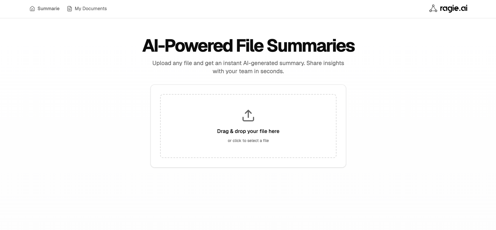

# Summarie

Summarie is an open-source reference application that demonstrates how to easily integrate Ragie for document ingestion and summarization.



## Features

- Document ingestion and processing
- Automatic document summarization using Ragie
- Modern Next.js application structure
- Clean and intuitive user interface

## Getting Started

First, install the dependencies:

```bash
npm install
# or
yarn install
# or
pnpm install
```

Then, run the development server:

```bash
npm run dev
# or
yarn dev
# or
pnpm dev
```

Open [http://localhost:3000](http://localhost:3000) with your browser to see the application.

## Project Structure

- `app/` - Next.js application code
- `components/` - Reusable React components
- `lib/` - Utility functions and Ragie integration code
- `public/` - Static assets

## Learn More

- [Ragie Documentation](https://docs.ragie.ai/) - Learn about Ragie's features and API


